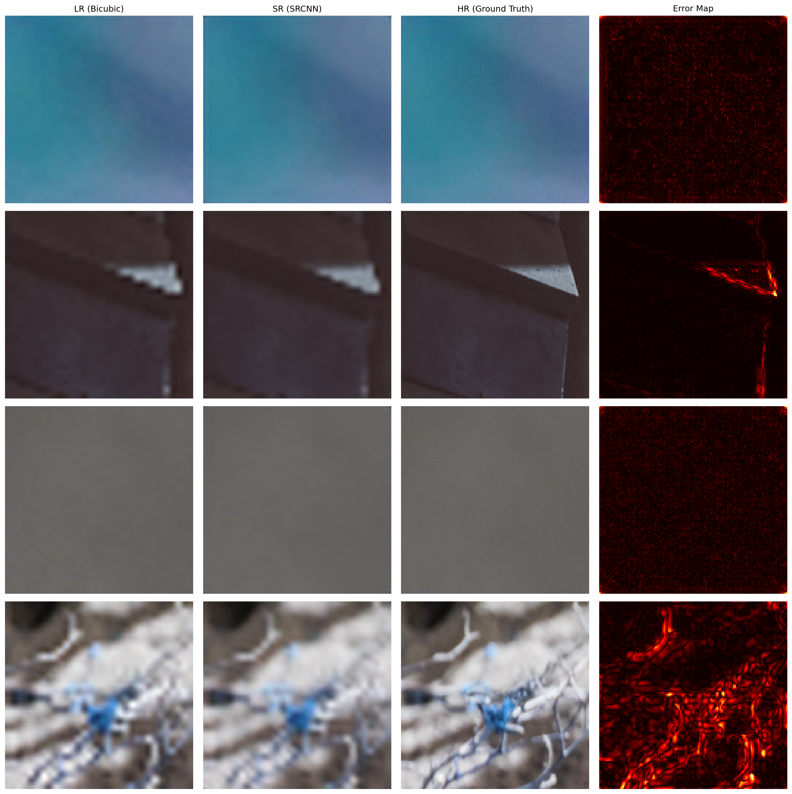
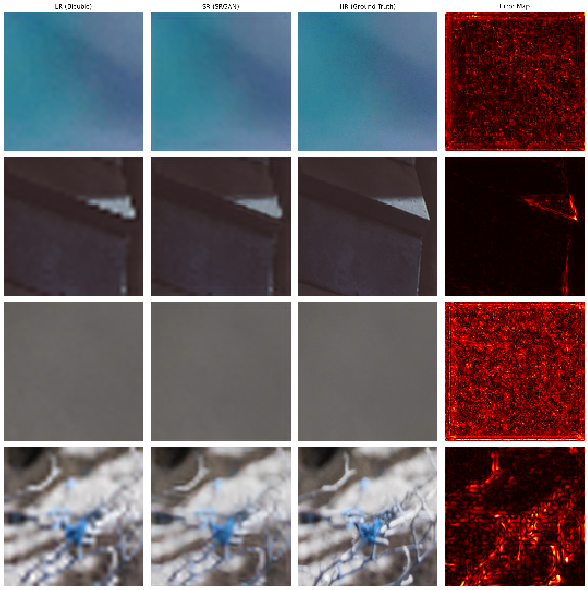
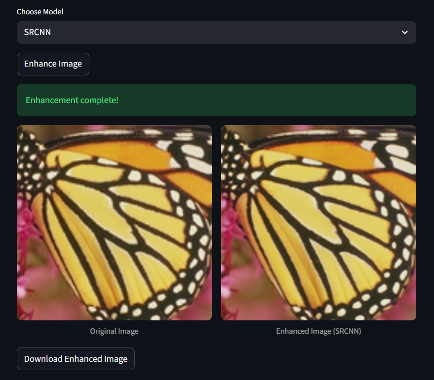
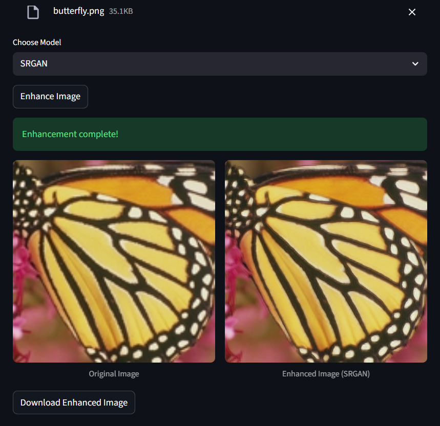

# superRes
[click here for final report](report.pdf)

Image super-resolution (SR) using convolutional neural networks (SRCNN) and a residual Generative Adversarial Networks(SRGAN).  
A minimal Streamlit GUI prototype for enhancement of low-resolution images.

- **Models**:
  - SRCNN: classical convolutional super-resolution network trained with MSE.
  - SRGAN generator: residual network used in a GAN with perceptual and adversarial losses.
- **Dataset** used for experiments: [DIV2K](https://data.vision.ee.ethz.ch/cvl/DIV2K/) (data preparation and training pipeline included in `train.ipynb`).

## Evaluation


| Metric | SRCNN | SRGAN |
|:-------|:------:|:------:|
| **PSNR (dB)** | 35.91 | 36.07 |
| **SSIM** | 0.8754 | 0.8779 |


**SRGAN performs slightly better** than SRCNN in both **PSNR** and **SSIM**, indicating improved perceptual and reconstruction quality.


## Quick start
1. Create Virtual environment
```bash
    python -m venv .venv
```
```bash
    .venv\Scripts\activate
```
2. Install dependencies:
```bash
   pip install -r requirements.txt
```
3. Run:
```bash
streamlit run app.py
```


## Visuals

  
  
  



